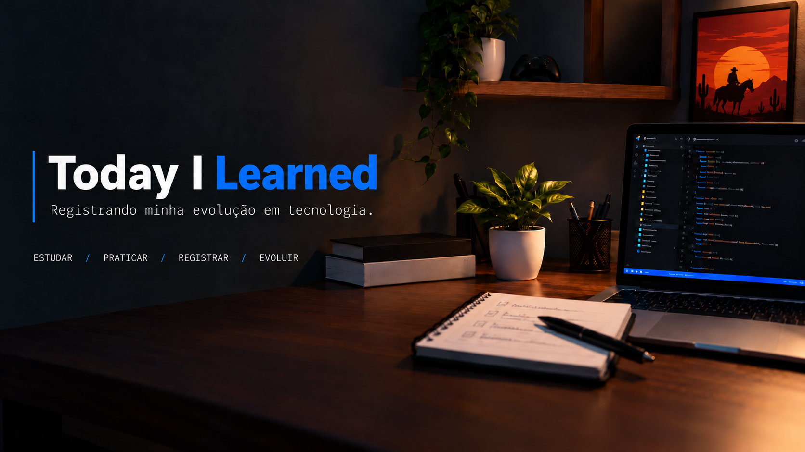

  

# 📚 Today I Learned

Este repositório contém anotações sobre os conhecimentos que adquiro durante meus estudos de tecnologia.

O objetivo é registrar minha evolução, praticar o que estou aprendendo e criar um material de consulta para o futuro.

---

## 💻 Tecnologias e áreas de estudo

---

## 📌 Sobre este repositório

O **Today I Learned** funciona como meu diário de estudos em tecnologia.

Aqui registro conceitos, exemplos, comandos, exercícios e soluções que considero importantes durante meu aprendizado.

O conteúdo será atualizado conforme avanço nos estudos e conheço novas ferramentas e tecnologias.

---

## 📂 Áreas de estudo

- 🌐 [**HTML**](./html) — Estrutura de páginas, tags e semântica
- 🎨 [**CSS**](./css) — Estilização, seletores, Box Model, Flexbox e responsividade
- ⚡ **JavaScript** — Fundamentos da linguagem e interação com páginas
- 🧠 **Lógica de Programação** — Variáveis, condições, loops e algoritmos
- 🐍 **Python** — Fundamentos, exercícios e pequenos projetos
- 🗄️ **MySQL** — Banco de dados e consultas SQL
- 🔧 **Git e GitHub** — Versionamento, commits, branches e repositórios

---

## 📝 O que registro

Neste repositório posso registrar:

- 📖 Conceitos importantes
- 💻 Exemplos de código
- 🛠️ Comandos úteis
- 🧩 Exercícios realizados
- 🔎 Problemas e soluções
- 💡 Descobertas durante os estudos
- 📌 Observações para consultas futuras
- ✅ Boas práticas que vou aprendendo

---

## 🎯 Objetivo

Utilizar este espaço para acompanhar minha evolução nos estudos de tecnologia e consolidar os conhecimentos adquiridos através da prática e da documentação.

Além de servir como material de consulta pessoal, este repositório também representa parte da minha jornada de aprendizado.

---

## 📈 Evolução contínua

Este repositório está em constante desenvolvimento.

Novos conteúdos serão adicionados naturalmente conforme avanço nos estudos, sem a necessidade de seguir uma ordem específica.

---

## 📅 Histórico

📌 **Início dos registros:** Setembro de 2026

---

  <b>📚 Estudar • 💻 Praticar • 📝 Registrar • 🚀 Evoluir</b>

